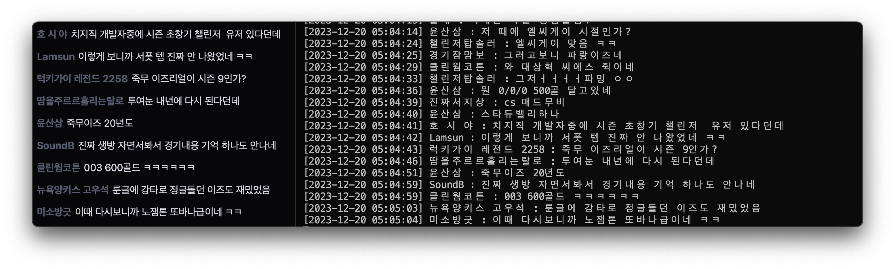

# Chzzk Chat Crawler

  

  

파이썬을 통해 네이버 치지직 서비스의 채팅을 크롤링 해봅시다.

이 코드는 [kimcore](https://github.com/kimcore/chzzk/tree/main)님의 코드를 기반으로 작성하였습니다.

## 설치

    # 코드 다운로드
    $ git clone https://github.com/Buddha7771/ChzzkChat .
    $ cd ChzzkChat

    # 가상환경 설치
    $ conda create -n chzzk python=3.9
    $ conda activate chzzk

    # 패키지 설치
    $ pip install -r requirements.txt

## 준비하기

1. 웹 브라우저에서 네이버를 키고 개발자 도구(F12)를 킵니다.
2. 쿠키탭에 들어가 `NID_AUT`와 `NID_SES` 값을 찾습니다.
3. 해당 값들을 `cookies.json` 파일에 들어가 붙여 넣습니다.

## 사용하기

    # 예시
    python run.py 

    # 특정 채널에 적용하려면 아이디를 찾아 옵션으로 넣습니다
    python run.py --streamer_id 9381e7d6816e6d915a44a13c0195b202

> 출력 내용은 자동으로 chat.log에 저장됩니다.   
> 작동을 중지하려면 `ctrl + c'을 눌러주세요.